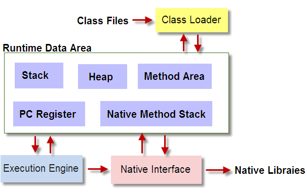

# Java虚拟机 #

1. 整个JVM分四个部分:
    1. ClassLoader 类加载器
        - 加载符合文件结构的class文件
    2. Execution Engine 执行引擎
        - 也叫解释器,负责解释命令,提交操作系统执行
    3. Native Interface 本地接口
        - 融合不同的编程语言,企业中使用比较少
    4. Runtime data area 运行数据区
        - 代码被加载到这里开始运行
  
2. JVM加载class文件的原理机制
    遇到一个新的类时,首先会到方法区去找class文件,如果没有找到就会去硬盘中找class文件,找到后会返回,将class文件加载到方法区中.在类加载的时候,静态成员变量会被分配到方法区的静态区域,非静态成员变量分配到非静态区域,然后开始给静态成员变量初始化,赋默认值,赋值完成根据静态成员变量书写的位置赋显示值,然后执行静态代码,当所有的静态代码执行完成,才算加载完成

3. java创建对象
    1. 用new创建的对象在堆区
    2. 函数中的临时变量在栈区
    3. Java中的字符串在字符常量区

4. 垃圾回收
    1. 老生代一般用标记,新生代一般用复制
    2. CMS
    3. G1